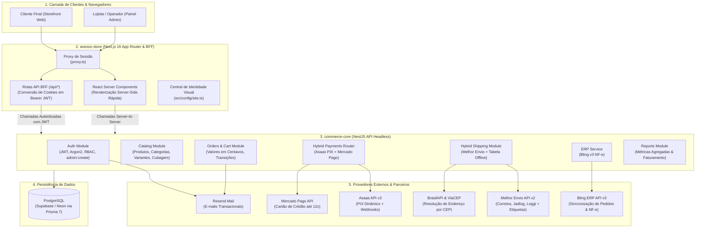
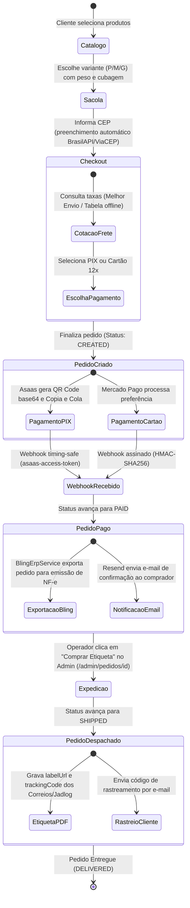
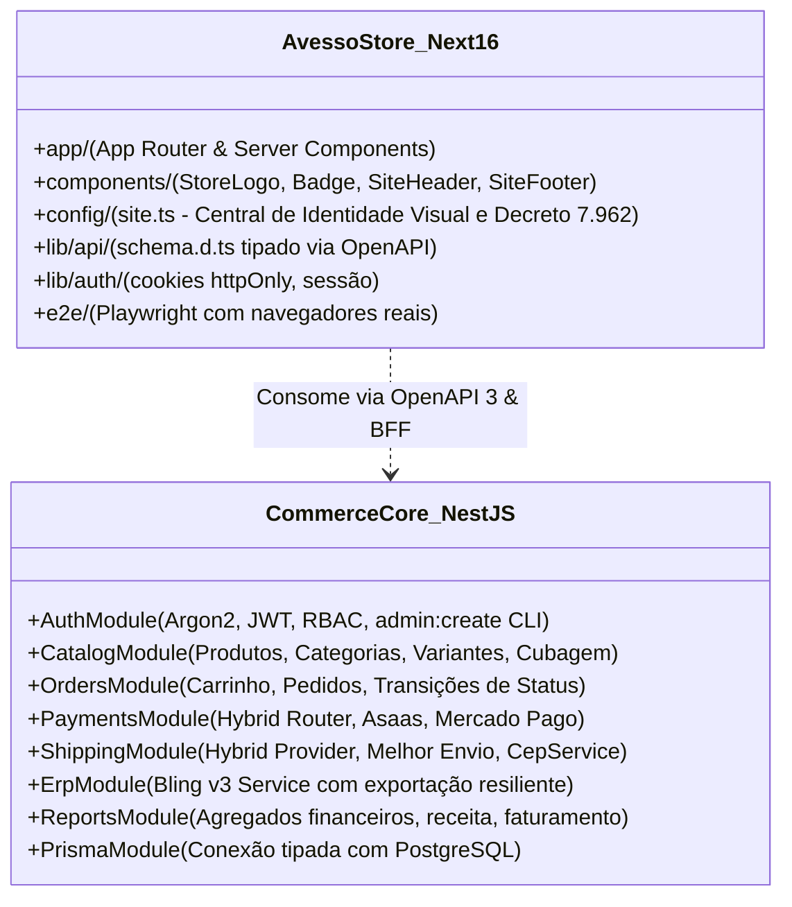

# Arquitetura do Sistema — AVESSO Store & Commerce-Core

Este documento documenta a arquitetura técnica, fluxo de dados e comunicação segura entre a vitrine storefront BFF (**`avesso-store`** em Next.js 16) e a API headless (**`commerce-core`** em NestJS).

---

## 1. Visão Geral do Ecossistema (Macroarquitetura)



---

## 2. Padrão BFF & Segurança de Sessão (Zero Token no Navegador)

O navegador do cliente **nunca acessa os tokens JWT nem segredos de infraestrutura**. O BFF em Next.js mantém a sessão em cookies `httpOnly`, assinados e seguros, convertendo-os em cabeçalhos `Authorization: Bearer <token>` nas chamadas server-to-server contra o backend:

```mermaid
sequenceDiagram
    autonumber
    actor Browser as Navegador (Cliente)
    participant BFF as avesso-store (BFF Next.js)
    participant Core as commerce-core (NestJS)
    participant DB as PostgreSQL

    Note over Browser,BFF: 1. Autenticação do Usuário
    Browser->>BFF: POST /api/auth/login (email, password)
    BFF->>Core: POST /auth/login (repasse server-to-server)
    Core->>DB: Busca usuário e valida hash Argon2id
    Core-->>BFF: Retorna { accessToken, refreshToken }
    Note over BFF: Grava accessToken e refreshToken em<br/>Cookies HTTP-Only e Secure
    BFF-->>Browser: HTTP 200 (Set-Cookie: session=...; HttpOnly)

    Note over Browser,BFF: 2. Requisição Protegida (ex: Sacola ou Checkout)
    Browser->>BFF: GET /sacola (envia apenas Cookie httpOnly)
    Note over BFF: Lê o Cookie internamente no servidor<br/>e injeta: Authorization: Bearer <token>
    BFF->>Core: GET /cart (com Authorization Header)
    Core->>Core: Valida assinatura do JWT e RBAC
    Core-->>BFF: Dados protegidos do carrinho
    BFF-->>Browser: HTML renderizado no servidor (RSC)
```

---

## 3. Ciclo de Vida do Pedido & Fluxo de Integrações (Order Lifecycle)



---

## 4. Estrutura Modular Interna dos Projetos



---

## 5. Esclarecimento sobre o Uso de Redis

- **Situação Atual:** O projeto **NÃO** utiliza Redis. Todos os caches (CEP com LRU TTL 24h) e limites de taxa rodam em memória do Node.js, e sessões/pedidos são gravados no PostgreSQL.
- **Lock Atômico:** Para os fluxos multi-tenant planejados na Sessão 10 (conector Mercado Livre), a exclusão mútua na renovação de tokens pode ser feita nativamente no **PostgreSQL** (`pg_advisory_xact_lock`), mantendo o custo de infraestrutura baixo e sem necessidade de cluster Redis externo.
